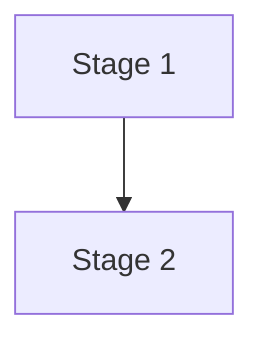

# Content Validation Rules

## MANDATORY: Validate Before File Creation

All generated content MUST be validated before writing to files to prevent parsing errors and broken artifacts.

---

## ASCII Diagram Validation

Before creating any file with ASCII diagrams:

1. **LOAD** `common/ascii-diagram-standards.md`
2. **VALIDATE** each diagram:
   - All lines in a box have EXACTLY the same character count (including spaces)
   - Use ONLY `+` `-` `|` `^` `v` `<` `>` and spaces
   - NO Unicode box-drawing characters (`┌─│└┐┘├┤▼▲►◄`)
   - Spaces only (NO tabs)
3. **TEST** alignment by verifying box corners align vertically in monospace

See `common/ascii-diagram-standards.md` for patterns and the validation checklist.

---

## Mermaid Diagram Validation

### Required Validation Steps

1. **Syntax check** — validate Mermaid syntax before file creation
2. **Character escaping** — escape special characters in labels: `"` → `\"`, `'` → `\'`
3. **Node ID rules** — alphanumeric + underscore only
4. **Fallback content** — provide a text alternative if Mermaid fails validation

### Mermaid Validation Rules

```markdown
## BEFORE creating any file with Mermaid diagrams:

1. Check for invalid characters in node IDs (alphanumeric + underscore only)
2. Escape special characters in labels
3. Validate flowchart syntax: node connections must be valid
4. Test diagram parsing with simple validation
5. Confirm reserved keywords are not used as node IDs (end, click, class, etc.)
```

### Implementation Pattern

````markdown
## Workflow Visualization

### Mermaid Diagram



### Text Alternative (always include)

Stage 1 → Stage 2 → ...
````

---

## Cross-Reference Validation

AI-DLC artifacts cross-link heavily. Before writing a file:

1. **Verify referenced files exist** at the relative path given
2. **Verify section anchors** (e.g., `requirements.md § 3.2`) match an actual heading
3. **Use relative paths** from the file's location, not absolute paths
4. **No broken cross-stage links** — a stage cannot complete with broken links to upstream artifacts

If a referenced file doesn't exist yet (it's expected to be created later), mark the link as `<pending>` and add a checklist item to update it.

---

## Checklist File Validation

Before writing a `*-checklist.md` file:

1. Every item is `- [ ]`, `- [x]`, or `- [~] N/A: <non-empty reason>`
2. No item is purely vague ("consider performance")
3. No item duplicates another in the same checklist
4. Sections have headings (## Section)
5. Modification log table is present (may be empty initially)

See `common/checklist-conventions.md` for full rules.

---

## Signoff File Validation

Before writing a signoff file (covering Gates #1–#4):

1. Both signature lines are present (`- [ ] Tech Lead:` and `- [ ] Dev:`)
2. ISO date placeholder is present
3. Compliance Summary table includes one row per opted-in extension
4. Open Risks section is present (may be "None")
5. The artifacts referenced exist

See `common/approval-gates.md` for the universal template.

---

## Question File Validation

Before writing a question file:

1. Each question has 2–5 meaningful options + `X) Other` (mandatory last)
2. Each question ends with `[Answer]:`
3. Options are mutually exclusive
4. Questions are clear, unambiguous, and answerable

See `common/question-format-guide.md`.

---

## General Content Validation

### Pre-Creation Checklist

- [ ] Validate embedded code blocks (Mermaid, JSON, YAML)
- [ ] Check special character escaping
- [ ] Verify markdown syntax correctness
- [ ] Test content parsing compatibility
- [ ] Include fallback content for complex visuals
- [ ] Confirm all relative paths resolve

### Error Prevention Rules

1. **Always validate before writing** — never write unvalidated content
2. **Escape special characters** — particularly in diagrams and code blocks
3. **Provide alternatives** — text versions of visual content
4. **Test syntax** — validate complex content structures

---

## Validation Failure Handling

When validation fails:
1. **Log the error** — record what failed in `audit.md`
2. **Use fallback content** — switch to text-based alternative for diagrams
3. **Continue workflow** — don't block on cosmetic content failures, but DO block on structural failures (missing signoff sections, missing checklist sections)
4. **Inform the user** — mention that simplified content was used and why

---

## What Counts as a Blocking Validation Failure

| Failure | Blocking? |
|---------|-----------|
| Mermaid won't parse | No — fall back to text |
| ASCII box widths uneven | Yes — fix before writing |
| Signoff file missing signature line | Yes — refuse to write |
| Checklist item with vague N/A reason | Yes — re-prompt user |
| Cross-stage link broken | Yes — fix or mark `<pending>` |
| Question file missing `X) Other` | Yes — regenerate |
| Question file missing `[Answer]:` tag | Yes — regenerate |

When in doubt: block. The cost of a malformed gate file is much higher than the cost of a one-cycle re-validation.
