# Process Overview — AI-DLC

**Purpose**: Technical reference for the model and developers showing the full AI-DLC workflow with stage classifications, gates, and depending on Tier.

---

## Stage Classification

| Symbol | Meaning |
|--------|---------|
| 🟢 | ALWAYS-EXECUTE stage (cannot be skipped regardless of Tier) |
| 🟡 | CONDITIONAL stage (executed based on Tier and content) |
| 🔵 | OPTIONAL stage (run only if user opts in) |
| ⛔ | Approval gate (signoff file required to advance) |

---

## Full Workflow (Mermaid)

```mermaid
flowchart TD
    start([User: 'Using AI-DLC, ...']) --> WD

    subgraph INCEPTION
        WD["🟢 0. Workspace Detection"]
        BR["🟢 1. Business Requirements Intake"]
        G1{"⛔ Gate #1<br/>BR signoff"}
        DI["🔵 2. Design Intake (optional)"]
        RE["🟡 3. Reverse Engineering<br/>(brownfield)"]
        RA["🟢 4. Requirements Analysis<br/>+ Extension opt-ins"]
        US["🟡 5. User Stories"]
        AD["🟡 6. Application Design"]
        WP["🟢 7. Workflow Planning"]
        G2{"⛔ Gate #2<br/>Plan signoff"}
        UG["🟡 7b. Units Generation"]
    end

    subgraph CONSTRUCTION
        FD["🟡 8. Functional Design (per UoW)"]
        NR["🟡 9. NFR Requirements (per UoW)"]
        GM1["🟢 /grill-me-1 (per UoW)<br/>85% MCQ quiz on FR/NFR"]
        ND["🟡 10. NFR Design (per UoW)"]
        SS["🟢 11. Stack Selection (per UoW)"]
        CGP["🟢 12a. Code Gen — Plan"]
        G3{"⛔ Gate #3<br/>Codegen signoff (per UoW)"}
        CGE["🟢 12b. Code Gen — Execute"]
        CR["🟢 13. Code Review<br/>lint + security + tests + AI"]
        G4V{"AI Verdict<br/>(PROCEED / BLOCK)"}
        MQ["🟢 14. Manual QA (per UoW)<br/>user attestation + bug-loop"]
        GM2["🟢 /grill-me-2 (per UoW)<br/>85% MCQ quiz on built UoW"]
        G4{"⛔ Gate #4 countersign<br/>Pod (per UoW)"}
        BT["🟢 15. Build & Test"]
    end

    subgraph OPERATIONS
        DG["🟢 16. Deployment Guide"]
        IAC["🟡 17. Infrastructure-as-Code"]
        OBS["🟡 18. Observability Setup"]
        PR["🟢 19. Production Readiness"]
        G5{"⛔ Gate #5<br/>Production Readiness signoff"}
    end

    WD --> BR --> G1
    G1 -->|signed| DI
    DI --> RE
    RE --> RA
    RA --> US --> AD --> WP --> G2
    G2 -->|signed| UG
    UG --> FD
    FD --> NR --> GM1
    GM1 -->|PASS / Bugfix-skip| ND
    GM1 -->|FAIL Branch B| NR
    ND --> SS --> CGP --> G3
    G3 -->|signed| CGE --> CR --> G4V
    G4V -->|PROCEED| MQ
    G4V -->|BLOCK| CGE
    MQ -->|bug-found| CGE
    MQ -->|all-PASS| GM2
    GM2 -->|PASS| G4
    GM2 -->|FAIL Branch B| MQ
    GM2 -->|FAIL Branch C| CR
    G4 -->|signed| BT
    BT --> DG
    DG --> IAC --> OBS --> PR --> G5
    G5 -->|signed| done([Project Released])

    classDef always fill:#dcfce7,stroke:#16a34a
    classDef cond fill:#fef9c3,stroke:#ca8a04
    classDef opt fill:#dbeafe,stroke:#2563eb
    classDef gate fill:#fee2e2,stroke:#dc2626

    class WD,BR,RA,WP,SS,CGP,CGE,CR,MQ,GM1,GM2,BT,DG,PR always
    class RE,US,AD,UG,FD,NR,ND,IAC,OBS cond
    class DI opt
    class G1,G2,G3,G4,G4V,G5 gate
```

(Text alternative for environments where Mermaid does not render: see the linear workflow listing in `core-workflow.md`.)

---

## Stage-by-Stage Reference

### Inception

| # | Stage | Class | Rule file | Gate? |
|---|-------|-------|-----------|-------|
| 0 | Workspace Detection | 🟢 | `inception/workspace-detection.md` | — |
| 1 | Business Requirements Intake | 🟢 | `inception/business-requirements.md` | ⛔ #1 |
| 2 | Design Intake | 🔵 | `inception/design-intake.md` | — |
| 3 | Reverse Engineering | 🟡 (brownfield) | `inception/reverse-engineering.md` | — |
| 4 | Requirements Analysis | 🟢 | `inception/requirements-analysis.md` | — |
| 5 | User Stories | 🟡 | `inception/user-stories.md` | — |
| 6 | Application Design | 🟡 | `inception/application-design.md` | — |
| 7 | Workflow Planning | 🟢 | `inception/workflow-planning.md` | ⛔ #2 |
| 7b | Units Generation | 🟡 | `inception/units-generation.md` | — |

### Construction (per Unit of Work loop)

| # | Stage | Class | Rule file | Gate? |
|---|-------|-------|-----------|-------|
| 8 | Functional Design | 🟡 | `construction/functional-design.md` | — |
| 9 | NFR Requirements | 🟡 | `construction/nfr-requirements.md` | — |
| — | `/grill-me-1` sub-ritual (post-9, pre-10) | 🟢 | `construction/grill-me-1.md` | — |
| 10 | NFR Design | 🟡 | `construction/nfr-design.md` | — |
| 11 | Stack Selection & Setup | 🟢 | `construction/stack-selection.md` | — |
| 12 | Code Generation (Plan → Execute) | 🟢 | `construction/code-generation.md` | ⛔ #3 |
| 13 | Code Review (lint + security + tests + AI) | 🟢 | `construction/code-review.md` | (verdict only) |
| 14 | Manual QA (user attestation + bug-loop) | 🟢 | `construction/manual-qa.md` | — |
| — | `/grill-me-2` sub-ritual (post-14, pre-Gate-#4) | 🟢 | `construction/grill-me-2.md` | ⛔ #4 countersign |
| 15 | Build & Test | 🟢 | `construction/build-and-test.md` | — |

### Operations

| # | Stage | Class | Rule file | Gate? |
|---|-------|-------|-----------|-------|
| 16 | Deployment Guide | 🟢 | `operations/deployment-guide.md` | — |
| 17 | Infrastructure-as-Code | 🟡 | `operations/infrastructure-as-code.md` | — |
| 18 | Observability Setup | 🟡 | `operations/observability-setup.md` | — |
| 19 | Production Readiness | 🟢 | `operations/production-readiness.md` | ⛔ #5 |

---

## Tier × Stage Execution Cheatsheet

| Stage | Greenfield | Feature | Bugfix |
|-------|-----------|---------|--------|
| 0 Workspace Detection | ✅ | ✅ | ✅ |
| 1 Business Requirements (~items) | ✅ ~20 | ✅ ~10 | ✅ ~5 |
| 2 Design Intake | ✅ offer | ✅ offer | 🔵 default skip |
| 3 Reverse Engineering | brownfield | brownfield | only if root cause unknown |
| 4 Requirements Analysis | Comprehensive | Standard | Minimal |
| 5 User Stories | ✅ | ✅ | ❌ |
| 6 Application Design | ✅ | ✅ if architecture changed | ❌ |
| 7 Workflow Planning | ✅ | ✅ | ✅ (light) |
| 7b Units Generation | ✅ if multi-service | rarely | ❌ |
| 8 Functional Design | ✅ | ✅ if logic changed | ❌ |
| 9 NFR Requirements | ✅ Comprehensive | ✅ Standard | ❌ unless regression |
| 10 NFR Design | ✅ | ✅ if NFR Req ran | ❌ |
| 11 Stack Selection | ✅ per UoW | ✅ for new UoWs | ❌ use existing |
| 12 Code Generation | ✅ Comprehensive plan | ✅ Standard plan | ✅ Minimal plan |
| 13 Code Review (AI verdict) | ✅ full | ✅ full | ✅ full (tests scoped to fix) |
| `/grill-me-1` (sub-ritual post-9) | ✅ 10–15 Qs | ✅ 7–10 Qs | 🔵 default skip; 3–5 Qs if Stage 9 ran |
| 14 Manual QA | full FR coverage | affected-flow + smoke | regression + adjacent flows |
| `/grill-me-2` (sub-ritual pre-Gate-#4) | ✅ 10–15 Qs | ✅ 7–10 Qs | ✅ 3–5 Qs (always-on) |
| 15 Build & Test | full suite | full unit + integration | regression-focused |
| 16 Deployment Guide | ✅ | ✅ | only if hotfix release |
| 17 Infrastructure-as-Code | ✅ if cloud target | ✅ if infra changed | ❌ |
| 18 Observability Setup | ✅ | ✅ if changed | ❌ |
| 19 Production Readiness | ✅ Gate #5 | ✅ Gate #5 | ✅ light-form |

---

## Per-UoW Loop

When Units Generation produces multiple Units of Work, the **Construction phase loops over them**. For each unit, the AI runs stages 8 → 14 fully (Functional Design → NFR Requirements → `/grill-me-1` → NFR Design → Stack Selection → Code Generation → Code Review → Manual QA → `/grill-me-2` → Gate #4 countersign) before starting the next unit. Stage 15 (Build & Test) runs ONCE after all units have passed Gate #4 countersign.

The loop ordering is recorded in `aidlc-state.md` under `## Unit Execution Order`. The pod may reorder before signing Gate #2.

### Code Review BLOCK loop

Within a single unit's iteration, if Code Review (Stage 13) emits a **BLOCK** verdict, the AI returns to Code Generation Part 2 (Stage 12b) to address findings, then re-runs Code Review. This BLOCK→Codegen→Review loop continues until either PROCEED is reached or the pod halts the loop and escalates (e.g., return to NFR Design or Functional Design).

---

## State Files

| File | Purpose |
|------|---------|
| `aidlc-state.md` | Persistent workflow state (Tier, current stage, completed stages, extension config, pod roster reference, unit execution order) |
| `audit.md` | Append-only audit trail (every user input + AI response with ISO timestamp) |
| `pod.md` | Pod roster (Tech Lead, Dev, substitutes) |
| `tier.md` | Active Tier — set by BR Intake, read by all downstream stages |

These four files are the workflow's source of truth. The AI MUST read them at the start of every stage.

---

## See Also

- `common/tiered-mode.md` — Tier definitions and the Tier × Behavior matrix
- `common/pod-ritual.md` — Pod composition and sign-off mechanics
- `common/approval-gates.md` — Gate templates and validation rules
- `common/checklist-conventions.md` — Universal checklist format
- `common/depth-levels.md` — Minimal / Standard / Comprehensive depth
- `core-workflow.md` (sibling directory) — The master entry point this file references
