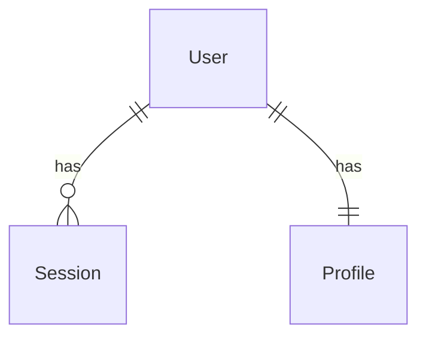
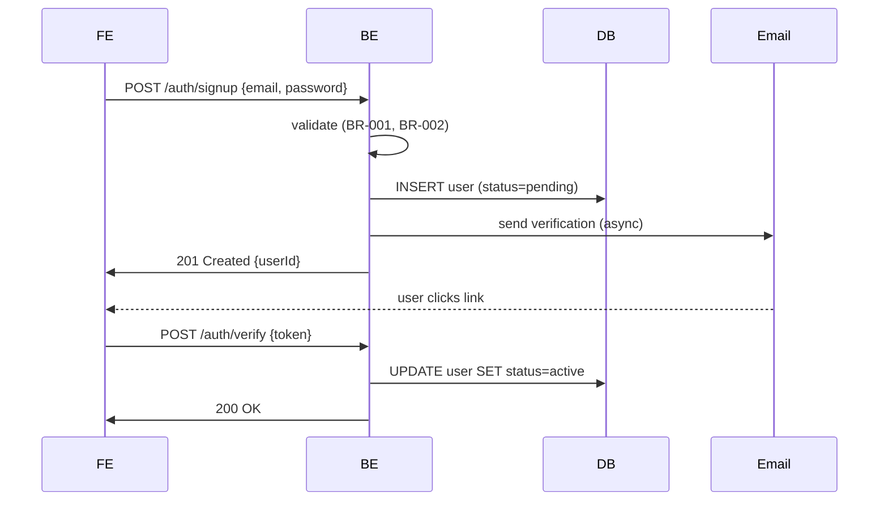

# Functional Design

**Stage**: 8 (conditional, per-UoW)
**Purpose**: Design the business logic and domain model for ONE Unit of Work. For full-stack UoWs, this includes domain entities (BE), business rules (BE), FE component tree (if FE in scope), and Mobile screens (if Mobile in scope).

---

## When to Execute

**Execute IF** (any):
- New data models or schemas
- Complex business logic
- Business rules that need explicit documentation
- New FE component hierarchy needed
- New Mobile screens needed

**Skip IF**:
- Trivial logic change
- No new business logic
- Bugfix Tier with localized fix

---

## Two-Part Pattern

**Plan → Generate**.

### Part 1 — Functional Design Planning

Generate `{unit}-functional-design-plan.md` and `{unit}-functional-design-questions.md`. Cover:
- **Domain entities** — what objects exist, what fields, what relationships
- **Business rules** — invariants, validation, decision logic
- **State transitions** — workflows, status machines
- **Data flow** — how data moves between FE/BE/Mobile
- **Integration points** — external APIs, queues
- **Error handling** — error envelope, user-facing error copy, retry policy
- **FE component tree** (if FE in scope) — hierarchy, props, state-management approach for this UoW
- **Mobile screens** (if Mobile in scope) — screens, navigation, state-management

Wait for answers. Validate.

### Part 2 — Functional Design Generation

Produce these artifacts under `aidlc-docs/construction/{unit}/functional-design/`:

#### `domain-entities.md`

```markdown
# Domain Entities — <unit>

## Entity: User
**Purpose**: <one line>

| Field | Type | Constraints | Notes |
|-------|------|-------------|-------|
| id | UUID | PK | server-generated |
| email | string | unique, lowercased | RFC 5321 ≤ 254 chars |
| createdAt | timestamp | | |
| ... | ... | ... | ... |

**Relationships**:
- has many `Sessions`
- has one `Profile`

**Lifecycle**:
- Created via signup; soft-deleted on account deletion (deletedAt set, PII redacted in 30 days per data retention policy in BR)

## Entity: <next>
…

## ER Diagram

```

#### `business-rules.md`

```markdown
# Business Rules — <unit>

## Rule BR-001: <Title>
**Applies to**: User signup
**Statement**: "Email must be unique across all non-deleted users."
**Enforcement**:
- DB: unique index on lowercased email where deletedAt IS NULL
- API: returns 409 if duplicate
- FE: client-side uniqueness check via debounced API call
**Error code**: `auth.email.duplicate`
**User-facing copy**: "An account with this email already exists. Sign in instead?"

## Rule BR-002: <…>
…
```

#### `business-logic-model.md`

```markdown
# Business Logic Model — <unit>

## Workflow: User Signup


## Workflow: <next>
…
```

#### `frontend-components.md` (only if FE in scope)

```markdown
# Frontend Components — <unit>

## Component Tree
```
<UnitRoot>
├── <SignupPage>
│   ├── <SignupForm>
│   │   ├── <EmailField>
│   │   ├── <PasswordField>
│   │   └── <SubmitButton>
│   └── <BrandLogo>
└── <VerifyEmailPage>
    └── <VerifyTokenForm>
```

## Components
| Component | Type | Props | State |
|-----------|------|-------|-------|
| SignupForm | form | onSubmit | controlled fields, submitting flag, errors map |
| EmailField | input | value, onChange, error | — |
| ... | ... | ... | ... |

## State Management
- Local state: `useState` for form fields
- Server state: <chosen library — TanStack Query / SWR / RTK Query / etc.>
- Routing: <chosen approach — App Router / Pages Router / React Router / etc.>

## Test IDs (team convention)
Every interactive element MUST have a `data-testid` following `<component>-<element-role>`:
- `signup-form-email`
- `signup-form-password`
- `signup-form-submit`
- `signup-form-error-email`
```

#### `mobile-screens.md` (only if Mobile in scope)

```markdown
# Mobile Screens — <unit>

## Screen: SignupScreen
**Route**: /signup
**Purpose**: <…>
**Widgets**:
- AppBar(title="Sign up")
- SignupForm
  - EmailField (TextFormField with email validator)
  - PasswordField (TextFormField with obscureText)
  - SubmitButton (ElevatedButton)
- BrandLogo

**State management**: <chosen approach — Riverpod / BLoC / Provider / etc.>

**Navigation in/out**:
- From: LandingScreen → tap "Sign up"
- On success: → VerifyEmailScreen with userId

**Test keys**: every interactive widget has a Key:
- ValueKey('signup-form-email')
- ValueKey('signup-form-password')
- ValueKey('signup-form-submit')

## Screen: <next>
…
```

---

### Step 3: Stage Checklist

`{unit}-functional-design-checklist.md`:
- [ ] Every entity in `domain-entities.md` has fields, constraints, and relationships
- [ ] Every business rule has BR-ID, statement, enforcement points, error code, user-facing copy
- [ ] Every workflow has a Mermaid sequence diagram + text alternative
- [ ] If FE in scope: every interactive element has a `data-testid`
- [ ] If Mobile in scope: every interactive widget has a `Key`
- [ ] AI/ML extension applicable rules addressed (if AI/ML enabled — see `extensions/ai-ml/lifecycle/ai-ml-lifecycle.md`)
- [ ] Accessibility rules addressed for FE and Mobile (if Accessibility extension enabled)

### Step 4: Completion Message

```markdown
# Functional Design — <unit> — Complete ✅

- **Entities**: <n>
- **Business rules**: <n>
- **Workflows**: <n>
- **FE components**: <n> (or N/A)
- **Mobile screens**: <n> (or N/A)

> **🚀 WHAT'S NEXT?**
>
> 🔧 **Request Changes**
> ✅ **Continue to Next Stage** — proceed to NFR Requirements (Stage 9)
```

Wait for approval. Log in `audit.md`.

---

## Anti-patterns

- ❌ Producing entities without constraints (every field needs nullable / unique / length / format)
- ❌ Business rules without error codes — downstream FE/Mobile cannot wire user-facing copy
- ❌ Skipping `data-testid` / `Key` conventions — Code Review (Stage 13) will block on this
- ❌ Treating frontend / mobile as out-of-scope when they are in BR — they're part of the same UoW
