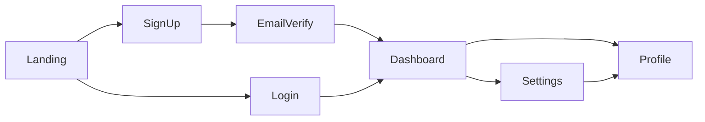

# Design Intake

**Stage**: 2 (optional)
**Gate**: none — but artifacts feed into Stages 6 (Application Design) and 8 (Functional Design — frontend components)
**Purpose**: Capture brand identity, design tokens, and screen flow before any architecture or code is produced. The user chooses how to provide design: Figma MCP, screenshots, or skip.

**Skills invoked at this stage**: `figma-mcp-extractor` (path A) OR `screenshot-design-parser` (path B) — exactly one, depending on the user's answer to Q1 of `design-intake-questions.md`. Path C (Skip) invokes neither. See `.aidlc/skills/inception/figma-mcp-extractor/SKILL.md` and `.aidlc/skills/inception/screenshot-design-parser/SKILL.md`.

---

## Why This Stage Exists

A 40-person team building full-stack products spends a lot of cycles re-deriving brand colors, typography scales, and screen flows from screenshots in chat. AI-DLC captures these once, in a structured form, so every downstream stage (FE component generation, Mobile screen generation, marketing copy) can read from `branding.md`, `design-tokens.md`, and `screen-flow-map.md` directly.

This stage is **optional** — when the project doesn't have design ready (early-stage greenfield, server-only backend feature, infra-only bugfix), the user can skip it.

---

## Prerequisites

- Stage 1 (Business Requirements Intake) complete — Gate #1 signed
- `aidlc-state.md` Tier is set

---

## Skip-by-Default Heuristics

If the Tier × stack signals strongly suggest there's no design surface, the AI may **propose** to skip but must still ask:

| Condition | Proposed default |
|-----------|------------------|
| Bugfix tier | Propose Skip |
| No FE or Mobile detected by Workspace Detection AND no FE/Mobile in BR scope | Propose Skip |
| Greenfield with FE or Mobile in scope | Propose A or B (no skip default) |
| Feature touching FE or Mobile | Propose A or B (no skip default) |

Even when proposing Skip, the user must explicitly choose. Auto-skip is forbidden.

---

## Execution Steps

### Step 1: Ask the user how they will provide design

Create `aidlc-docs/inception/design/design-intake-questions.md`:

```markdown
# Design Intake — Choose Path

AI-DLC can capture design in one of three ways. Pick whichever
fits where your project is right now.

## Question 1
How would you like to provide the design assets?

A) Connect Figma via MCP — I have a Figma file and can connect the Figma MCP server
B) Provide screenshots — I'll drop screenshots of the screens, brand assets, and logo into a folder
C) Skip — design isn't ready yet (downstream stages will produce design-agnostic placeholders)
X) Other (please describe after [Answer]: tag below)

[Answer]:

## Question 2 (only if you chose A)
Paste the Figma file URL(s):

[Answer]:

## Question 3 (only if you chose B)
Place your screenshots and brand assets here (create the folder if it doesn't exist):

  aidlc-docs/inception/design/uploads/

Then list the file names below (one per line) and a one-word label for each
(e.g., "logo", "home-screen", "color-palette", "brand-guide-page-3").

[Answer]:

## Question 4 (only if you chose C — Skip)
Why are you skipping design intake? (Pick the closest reason — this is recorded
in audit.md and may inform downstream defaults.)

A) Design will be done later — code first
B) This is a backend/infra-only piece — no UI surface
C) Bugfix doesn't change UI
D) Designer not yet engaged
X) Other (please describe after [Answer]: tag below)

[Answer]:
```

After the user answers:

- Validate per `common/question-format-guide.md`
- If they chose **A** but the Figma URL is missing or unreachable → ask for correction or fall back to B
- If they chose **B** but the uploads folder is empty → ask for upload or fall back to C
- If they chose **X** → resolve to one of A / B / C via clarification

Log the chosen path in `audit.md`.

---

### Step 2A: Figma MCP Path

If the user chose **A**:

1. **Verify Figma MCP server is configured.** Check the IDE's MCP configuration. If not configured, present:

```
"The Figma MCP server isn't configured in your IDE. To proceed with the
Figma path, install and configure the Figma MCP server (see your IDE's
MCP setup docs). Otherwise, switch to the Screenshots path (B) by
re-answering design-intake-questions.md."
```

Stop and wait.

2. **Fetch frames.** For each Figma file URL provided:
   - Use the Figma MCP server to list pages and frames
   - Pull the design tokens via the MCP server's variables/styles endpoint
   - Pull frame metadata (names, navigation links between frames)
   - Pull image previews of the top-level frames into `aidlc-docs/inception/design/figma-export/<file-id>/`

3. **Validate completeness:**
   - At least one frame fetched
   - Token set is non-empty (colors + typography minimum)
   - Frame names follow some recognizable convention (or report ambiguity to the user)

4. **If validation fails** (e.g., Figma file is empty or restricted), log the failure and ask the user to either provide a different file or fall back to Screenshots (B).

---

### Step 2B: Screenshots Path

If the user chose **B**:

1. Verify `aidlc-docs/inception/design/uploads/` contains the files listed in Question 3
2. For each file, record:
   - Path
   - User's one-word label
   - Image dimensions (if readable)
   - Detected dominant colors (top 5 hex values)
3. If any listed file is missing or unreadable, ask the user to re-upload or correct the list

The AI does NOT need OCR or computer vision beyond color extraction and basic image metadata. Visual interpretation happens during artifact generation in Step 3.

---

### Step 2C: Skip Path

If the user chose **C**:

1. Record the skip reason in `aidlc-docs/inception/design/skipped.md`:

```markdown
# Design Intake — Skipped

**Skipped at**: <ISO>
**Reason** (Q4 answer): <A | B | C | D | X — full text>

Downstream stages will produce design-agnostic placeholders:
- Application Design: FE component tree will use generic component names
- Functional Design (per FE/Mobile UoW): screen specs will reference placeholder copy
- Code Generation: FE/Mobile UoWs will use the chosen framework's defaults
  (e.g., shadcn/ui defaults for React, Material defaults for Flutter)

The pod may revisit Design Intake later via `common/workflow-changes.md` § Adding a Skipped Stage.
```

2. Update `aidlc-state.md`:

```markdown
| 2 | Design Intake | SKIPPED — see design/skipped.md |
```

3. Skip Steps 3–5 and go directly to Step 6.

---

### Step 3: Generate `branding.md`

Only if Step 2A or Step 2B ran. Create `aidlc-docs/inception/design/branding.md`:

```markdown
# Branding

**Source**: <Figma file: <name> | Screenshots: <list>>
**Captured at**: <ISO>

## Logo

| Asset | Path | Format | Notes |
|-------|------|--------|-------|
| Primary logo | <path> | <SVG/PNG> | <e.g. light-bg variant> |
| Inverted logo | <path> | <fmt> | <dark-bg variant> |
| Icon / favicon | <path> | <fmt> | <usage> |

If only one logo asset was provided, list it as Primary and note that
inverted/icon variants are missing — flag in stage checklist.

## Brand Colors

| Role | Hex | Source | Usage notes |
|------|-----|--------|-------------|
| Primary | #XXXXXX | <Figma var name / screenshot label> | <e.g., CTAs, main brand> |
| Secondary | #XXXXXX | ... | ... |
| Accent | #XXXXXX | ... | ... |
| Background (light) | #FFFFFF | ... | ... |
| Background (dark) | #0A0A0A | ... | ... |

## Voice & Tone (only if user provided brand-guide / voice content)

| Aspect | Description |
|--------|-------------|
| Voice | <e.g., "Confident, technical, optimistic"> |
| Tone for marketing | <...> |
| Tone for product UI | <...> |
| Forbidden words / phrases | <list> |
| Reading level target | <e.g., 8th grade> |

If voice/tone is not provided, mark this section "Not provided — to be
defined by Marketing or Stakeholder before launch."
```

---

### Step 4: Generate `design-tokens.md`

Create `aidlc-docs/inception/design/design-tokens.md` capturing:

```markdown
# Design Tokens

**Source**: <as above>

## Color Palette

```json
{
  "color": {
    "primary": { "50": "#…", "100": "#…", ..., "900": "#…" },
    "neutral": { ... },
    "success": { ... },
    "warning": { ... },
    "danger": { ... }
  }
}
```

## Typography

```json
{
  "font": {
    "family": {
      "sans": "Inter, system-ui, sans-serif",
      "mono": "JetBrains Mono, monospace"
    },
    "weight": { "regular": 400, "medium": 500, "semibold": 600, "bold": 700 },
    "size":   { "xs": 12, "sm": 14, "base": 16, "lg": 18, "xl": 20, "2xl": 24, "3xl": 30, "4xl": 36, "5xl": 48 },
    "lineHeight": { "tight": 1.2, "normal": 1.5, "relaxed": 1.75 }
  }
}
```

## Spacing

```json
{
  "space": { "0": 0, "1": 4, "2": 8, "3": 12, "4": 16, "6": 24, "8": 32, "12": 48, "16": 64, "24": 96 }
}
```

## Radii

```json
{ "radius": { "none": 0, "sm": 4, "md": 8, "lg": 12, "xl": 16, "full": 9999 } }
```

## Shadows

```json
{ "shadow": { "sm": "...", "md": "...", "lg": "..." } }
```

## Notes

- Token names follow the W3C Design Tokens Format Module convention so they
  can be exported to Tailwind / Style Dictionary / Flutter ThemeData.
- For tokens not present in the source, mark the value as `null` and note
  "to be specified" — do NOT invent values.
```

When Figma is the source, populate from Figma variables. When screenshots are the source, the AI extracts color palette and best-effort typography (estimated from image inspection of headings/body); typography scale should be flagged "approximate — confirm with designer".

---

### Step 5: Generate `screen-flow-map.md`

Create `aidlc-docs/inception/design/screen-flow-map.md` with a Mermaid navigation graph:

```markdown
# Screen Flow Map

**Source**: <as above>
**Captured at**: <ISO>

## Screens

| # | Screen | Description | Tier-1 / Tier-2 |
|---|--------|-------------|-----------------|
| 1 | Landing | Marketing home | Tier-1 |
| 2 | Sign Up | Account creation | Tier-1 |
| 3 | Dashboard | Logged-in landing | Tier-1 |
| 4 | Settings | Profile / preferences | Tier-2 |
| ... | ... | ... | ... |

## Navigation Graph



(See `common/content-validation.md` for Mermaid validation rules and the text-alternative requirement.)

## Text Alternative

- Landing → SignUp / Login
- SignUp → EmailVerify → Dashboard
- Login → Dashboard
- Dashboard → Settings → Profile
- Dashboard → Profile

## Open Questions

- <list any ambiguous or missing screens — these become items the pod must
  resolve before Application Design (Stage 6)>
```

When Figma is the source, frame-to-frame links can be derived from Figma's prototype connections. When screenshots are the source, ask the user to confirm the navigation by uploading a flow diagram OR by describing transitions in plain text.

---

### Step 6: Stage Checklist

Generate `aidlc-docs/inception/design/design-intake-checklist.md`:

```markdown
# Design Intake Checklist

**Tier**: <…>

## Items

### Section 1 — Path
- [ ] User asked which path: Figma MCP / Screenshots / Skip
- [ ] Path recorded in audit.md
- [ ] If A: Figma MCP verified configured
- [ ] If A: Figma file fetched successfully
- [ ] If B: uploads/ folder populated as listed
- [ ] If C: skipped.md created with reason

### Section 2 — Artifacts (only if A or B)
- [ ] branding.md generated and contains logo + ≥3 brand colors
- [ ] design-tokens.md generated with color/typography/spacing/radii at minimum
- [ ] screen-flow-map.md generated with Mermaid diagram + text alternative
- [ ] Open questions in screen-flow-map.md are explicit (or marked "None")

### Section 3 — Routing
- [ ] aidlc-state.md updated to STAGE 2: COMPLETE or SKIPPED
- [ ] audit.md updated with all interactions
```

Mark every item `[x]` or `[~] N/A: <reason>` before completion.

---

### Step 7: Completion Message

```markdown
# Design Intake — Complete ✅

**Path**: <Figma MCP | Screenshots | Skipped>
<if A or B>
- branding.md   — logo + N brand colors captured
- design-tokens.md — typography/spacing/radii captured
- screen-flow-map.md — N screens, M transitions

<if C>
- Skipped (reason: <reason>)

> **🚀 WHAT'S NEXT?**
>
> 🔧 **Request Changes** — request edits before proceeding
> ✅ **Continue to Next Stage** — proceed to <Reverse Engineering (brownfield) | Requirements Analysis (greenfield)>
```

Wait for the user's choice. Auto-proceed not allowed — even though the artifacts are produced, the user may want to add more screenshots or fix tokens.

---

## Anti-patterns

- ❌ Auto-proceeding to Skip without asking
- ❌ Inventing token values when the source doesn't provide them — null + "to be specified" is correct
- ❌ Producing `branding.md` without at least logo + 3 colors
- ❌ Generating screen-flow-map without text alternative
- ❌ Treating Figma MCP failure as fatal — always offer fallback to Screenshots
- ❌ Mixing Figma exports and uploaded screenshots in one stage run — pick one path; user can re-run later for additions
