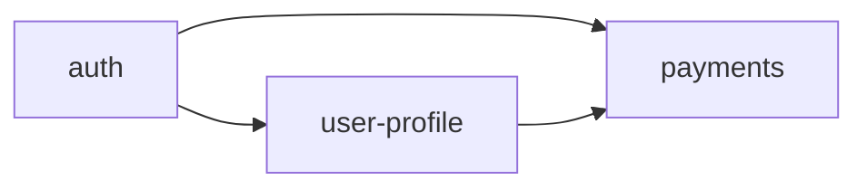

# Units Generation

**Stage**: 7b (conditional — runs after Workflow Planning if multi-unit decomposition is needed)
**Purpose**: Decompose the project into Units of Work (UoWs). For full-stack projects, a UoW typically bundles related FE + BE + Mobile work that ships together.

---

## When to Execute

**Execute IF** (any):
- Application Design proposed multiple components/services
- Multiple stories naturally group into independently deployable / testable bundles
- Greenfield Tier with full-stack scope (default execute)
- Microservices architectural style chosen

**Skip IF**:
- Single-component change (one bolt, one UoW implicitly)
- Bugfix Tier (single UoW = the fix)
- Monolith with one clear module

---

## Two-Part Pattern

**Plan → Generate**.

### Part 1 — Units Planning

Generate `units-generation-plan.md` with checklist + `units-generation-questions.md` covering:
- **Decomposition criteria** — by feature area / by deployable / by team / by data domain
- **UoW size** — t-shirt size; should fit in 1–3 bolts
- **Dependency tolerance** — strictly DAG / allow forward references
- **Cross-stack bundling policy** — keep FE+BE+Mobile work together per UoW (team default) OR split per stack
- **Naming convention** — kebab-case domain names (e.g., `auth`, `user-profile`, `payments`)

Wait for answers. Validate.

### Part 2 — Units Generation

Produce three artifacts under `aidlc-docs/inception/units/`:

#### `unit-of-work.md`

```markdown
# Units of Work

## UoW: <name>
**Description**: <one-line>
**Stacks involved**: <FE | BE-Node | BE-Python | BE-Go | Mobile | combinations>
**Stories**: <list of US-IDs>
**Components**: <list of components from components.md that this UoW owns>
**Estimated size**: <S | M | L | XL>
**Independently deployable**: <Yes | No — if No, name the dependent UoWs>
**Code organization** (greenfield only):
  - For microservices: directory `<name>/` at workspace root
  - For monolith: directory `src/<name>/` (BE) and `app/<name>/` (FE) and `lib/<name>/` (Flutter)

## UoW: <next-name>
…
```

#### `unit-of-work-dependency.md`

A dependency matrix + Mermaid graph showing UoW → UoW dependencies. Detect cycles; refuse to advance if cycles exist (per `common/error-handling.md` § Design Errors).

```markdown
# UoW Dependency

## Matrix
|        | auth | user-profile | payments | ... |
|--------|------|--------------|----------|-----|
| auth   |  -   |              |          |     |
| user-profile | depends |  -   |          |     |
| payments | depends |       |    -    |     |
| ...    |       |             |          |     |

## Graph

```

#### `unit-of-work-story-map.md`

```markdown
# Story → UoW Mapping

| Story ID | Story Title | UoW | Notes |
|----------|-------------|-----|-------|
| US-001 | Sign up | auth | spans FE + BE |
| US-002 | Edit profile | user-profile | spans FE + BE + Mobile |
| ... | ... | ... | ... |
```

Every story must map to exactly one UoW. If a story spans multiple UoWs, split it.

---

### Step 3: Update Execution Order

Append the UoW execution order to `aidlc-state.md` `## Unit Execution Order` (was provisionally set in Workflow Planning; finalize here based on the dependency graph).

### Step 4: Stage Checklist

`units-generation-checklist.md`:
- [ ] Every story is mapped to a UoW
- [ ] No cyclic dependencies
- [ ] Every UoW is named in kebab-case
- [ ] Every UoW has stacks listed
- [ ] Code organization conforms to monolith vs microservices choice
- [ ] Cross-stack bundling policy applied consistently

### Step 5: Completion Message

```markdown
# Units Generation — Complete ✅

- **UoW count**: <n>
- **Cross-stack bundling**: <kept-together | split-per-stack>
- **Execution order**: <list>

> **🚀 WHAT'S NEXT?**
>
> 🔧 **Request Changes**
> ✅ **Continue to Next Stage** — begin per-UoW Construction loop with <first UoW>
```

Wait for approval. Then begin Construction phase per `core-workflow.md`.

---

## Team Defaults

- **Cross-stack bundling**: by default, a feature that spans FE + BE + Mobile is one UoW unless the stacks have very different deployment cadence
- **Naming**: kebab-case domain noun, no team or stack suffixes (e.g. `payments` not `payments-be-team`)
- **Size**: aim for M; refactor any L into two M's where possible

---

## Anti-patterns

- ❌ Producing UoWs that are not independently testable
- ❌ Allowing cyclic dependencies — refuse to advance and ask the pod to redesign
- ❌ Naming UoWs after teams or technologies
- ❌ Splitting tightly coupled FE+BE work into two UoWs (causes coordination cost)
- ❌ A story mapped to no UoW or to multiple UoWs
