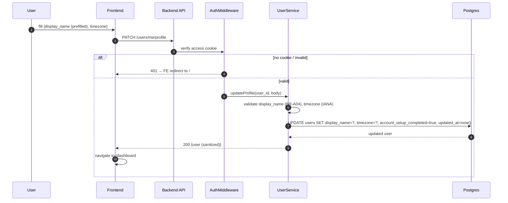

# Business Logic Model — auth UoW

**Generated**: 2026-05-12T00:15:00Z

Five workflows, each with a Mermaid sequence diagram + text alternative + key invariants.

---

## Workflow 1: Signup

```mermaid
sequenceDiagram
    autonumber
    participant U as User
    participant FE as Frontend
    participant API as Backend API
    participant Svc as AuthService
    participant Hash as PasswordHasher
    participant DB as Postgres
    participant Stub as EmailStub (stdout)

    U->>FE: fill {email, display_name, password}
    FE->>FE: client validate (BR-A01, BR-A04, BR-A05)
    FE->>API: POST /auth/signup
    API->>API: ValidationMiddleware (BR-A01,04,05)
    API->>Svc: signup(input)
    Svc->>Svc: normalize email (BR-A02)
    Svc->>DB: find user by email
    DB-->>Svc: not found
    Svc->>Hash: hash(password) (BR-A03)
    Hash-->>Svc: $argon2id$...
    Svc->>DB: INSERT users (verified=true, setup=false)
    DB-->>Svc: new user
    Svc->>Stub: emit JSON line {event, to, subject, body, verification_token, request_id, timestamp}
    Svc->>Svc: mint family_id, access JWT (15m), refresh JWT (7d) (BR-A08)
    Svc->>DB: INSERT refresh_tokens (parent_id=NULL)
    Svc-->>API: SignupOutcome
    API->>FE: 201 Set-Cookie: access; refresh (BR-A10)
    FE->>FE: navigate to /account-setup
    FE-->>U: Account Setup form
```

### Text alternative

1. User fills signup form (email, display_name, password).
2. FE validates client-side (BR-A01 email format, BR-A04 display_name length, BR-A05 password ≥ 12).
3. FE posts to `/auth/signup`.
4. API ValidationMiddleware re-validates server-side (authoritative per NFR-S06).
5. AuthService normalizes email to lowercase (BR-A02).
6. Service checks for existing user by email.
7. If exists → return `auth.credentials.invalid` (BR-A07 enumeration-safe); STOP. If not exists → continue.
8. PasswordHasher hashes password with Argon2id (BR-A03).
9. INSERT new user row with `verified=true`, `account_setup_completed=false`.
10. EmailStub emits a single JSON line to stdout (Q2=A schema).
11. Mint family_id (UUID), access JWT (15min), refresh JWT (7d) — all RS256 (BR-A08).
12. INSERT refresh_tokens row with `parent_id=NULL` (first of family).
13. Controller sets cookies (BR-A10 flags) and returns 201.
14. FE navigates to `/account-setup`.

---

## Workflow 2: Login

```mermaid
sequenceDiagram
    autonumber
    participant U as User
    participant FE as Frontend
    participant API as Backend API
    participant RL as RateLimitMiddleware
    participant Svc as AuthService
    participant Hash as PasswordHasher
    participant DB as Postgres

    U->>FE: fill {email, password}
    FE->>API: POST /auth/login
    API->>RL: check counter for email
    alt 6th+ attempt within 15 min
        RL-->>FE: 429 Retry-After (BR-A06)
        FE-->>U: "Too many attempts. Try again in N min."
    else allowed
        RL->>Svc: login(input)
        Svc->>Svc: normalize email (BR-A02)
        Svc->>DB: SELECT user by email
        alt not found
            Svc->>RL: record failure
            Svc-->>FE: 401 auth.credentials.invalid (BR-A07)
        else found
            Svc->>Hash: verify(password, user.password_hash)
            alt mismatch
                Hash-->>Svc: false
                Svc->>RL: record failure
                Svc-->>FE: 401 auth.credentials.invalid (BR-A07) [SAME BODY as above]
            else match
                Hash-->>Svc: true
                Svc->>Svc: mint family_id, access JWT, refresh JWT (BR-A08)
                Svc->>DB: INSERT refresh_tokens (parent_id=NULL)
                Svc-->>FE: 200 Set-Cookie: access; refresh
                FE->>FE: navigate to /dashboard (if setup_completed) else /account-setup
            end
        end
    end
```

### Text alternative
1. User submits login form.
2. RateLimitMiddleware checks the in-memory counter for the email.
3. If ≥ 5 failures in 15 min → return 429 with `Retry-After` (BR-A06); STOP.
4. Otherwise → AuthService.login: normalize email; lookup user.
5. If user not found → record failure; return `auth.credentials.invalid` (BR-A07).
6. If user found → verify password. On mismatch → record failure; return SAME BODY as step 5 (enumeration safety).
7. On match → mint new family, sign access + refresh JWTs; INSERT refresh_tokens row.
8. Set cookies; return 200.
9. FE navigates to `/dashboard` if `account_setup_completed=true`, else `/account-setup`.

---

## Workflow 3: Refresh (rotation + replay detection)

```mermaid
sequenceDiagram
    autonumber
    participant FE as Frontend (interceptor)
    participant API as Backend API
    participant Svc as AuthService
    participant DB as Postgres

    Note over FE: triggered on any 401 from a protected call
    FE->>API: POST /auth/refresh (cookie carries token)
    API->>Svc: refresh(presentedRefreshToken)
    Svc->>Svc: token_hash = sha256(token)
    Svc->>DB: SELECT refresh_tokens WHERE token_hash = ?
    alt not found OR expired OR revoked
        DB-->>Svc: nope
        Svc-->>FE: 401 auth.session.invalid
    else found
        alt row.rotated_at IS NOT NULL
            Note over Svc,DB: REPLAY DETECTED — revoke family (BR-A09)
            Svc->>DB: UPDATE refresh_tokens SET revoked=true WHERE family_id=row.family_id
            Svc-->>FE: 401 auth.session.invalid
        else still current
            Svc->>Svc: mint new access JWT + new refresh JWT (same family_id)
            Svc->>DB: BEGIN tx
            Svc->>DB: UPDATE row SET rotated_at = now()
            Svc->>DB: INSERT refresh_tokens (parent_id=row.id, family_id=row.family_id)
            Svc->>DB: COMMIT
            Svc-->>FE: 200 Set-Cookie: access; refresh (rotated pair)
        end
    end
```

### Text alternative
1. FE interceptor catches a 401 on any protected call → POSTs to `/auth/refresh`.
2. AuthService computes `sha256(token)`; SELECTs by hash.
3. If not found / expired / revoked → 401 (`auth.session.invalid`).
4. If found AND `rotated_at IS NOT NULL` → **REPLAY** → revoke entire family; 401.
5. If found AND currently-valid → mint new pair; atomically mark old row as rotated and insert new row in same family.
6. Set cookies; return 200. FE retries the original request.

---

## Workflow 4: Logout

```mermaid
sequenceDiagram
    autonumber
    participant U as User
    participant FE as Frontend
    participant API as Backend API
    participant Svc as AuthService
    participant DB as Postgres

    U->>FE: click Logout
    FE->>API: POST /auth/logout (cookies carry tokens)
    API->>Svc: logout(presentedRefreshToken)
    alt token missing
        Svc-->>FE: 204 (idempotent)
    else token present
        Svc->>Svc: token_hash = sha256(token)
        Svc->>DB: SELECT refresh_tokens WHERE token_hash = ?
        opt found and not revoked
            Svc->>DB: UPDATE refresh_tokens SET revoked=true WHERE family_id=row.family_id
        end
        Svc-->>FE: 204 Set-Cookie: access=; refresh=; Max-Age=0
    end
    FE->>FE: clear local cache; navigate to /
    FE-->>U: show "Signed out" toast (5s)
```

### Text alternative
1. User clicks Logout. FE POSTs to `/auth/logout`.
2. If no cookie present → 204 idempotent.
3. If cookie present → SHA-256 hash; look up; if found revoke whole family.
4. Return 204 with `Set-Cookie ... Max-Age=0` for both cookies (clears them in the browser).
5. FE clears local cache; navigates to Landing; shows "Signed out" toast for 5 seconds.

---

## Workflow 5: Account Setup submission



### Text alternative
1. User fills the account-setup form (display_name pre-filled from signup; timezone dropdown default = `Asia/Kolkata`).
2. FE PATCHes `/users/me/profile`.
3. AuthMiddleware verifies the access cookie. If missing/invalid → 401; FE redirects to Landing.
4. UserService validates inputs.
5. UPDATE users row; set `account_setup_completed=true`.
6. Return sanitized user record (no `password_hash`).
7. FE navigates to `/dashboard`.

---

## State machines

### `User.account_setup_completed`
```
[signup] →  false  →  [submit account-setup form]  →  true
                                                       (terminal in v1 — no edit-profile flow)
```

### `RefreshToken` row
```
                      ┌──[POST /auth/refresh while still valid]──→ rotated_at SET → (rotated)
                      │
[INSERT]→ active ─────┤
                      ├──[POST /auth/logout]─────────────────────→ revoked=true via family ──→ (revoked)
                      │
                      └──[expires_at < now]──────────────────────→ (expired; cleanup task may delete)

[replay] on a rotated row ─→ ALL rows in family.revoked = true (this is the security invariant BR-A09 enforces)
```

---

## Invariant summary (Stage 13 + Stage 14 verify)

| # | Invariant | Where verified |
|---|-----------|----------------|
| 1 | Email is always stored lowercase | Stage 13 (PBT NFR-T02c); Stage 14 (Manual QA: sign up with `Foo@CODISTE.COM` → DB row has `foo@codiste.com`) |
| 2 | Password hash starts `$argon2id$` | Stage 13 (test); Stage 14 |
| 3 | Signup-duplicate response ≡ Login-fail response (byte-identical body) | Stage 13 (paired test for NFR-S09); Stage 14 (Manual QA) |
| 4 | Refresh-token replay revokes the whole family | Stage 13 (PBT NFR-T02d); Stage 14 |
| 5 | `account_setup_completed=false` user is redirected to `/account-setup` on any non-setup route | Stage 14 (Manual QA scenario E9) |
| 6 | Plaintext password / JWT never appear in logs | Stage 13 (log-scrape test); Stage 14 (manual DevTools check) |
| 7 | Cookies carry `HttpOnly + SameSite=Lax + Path=/` (and `Secure` in non-dev) | Stage 13 (integration test); Stage 14 (DevTools cookies panel) |
