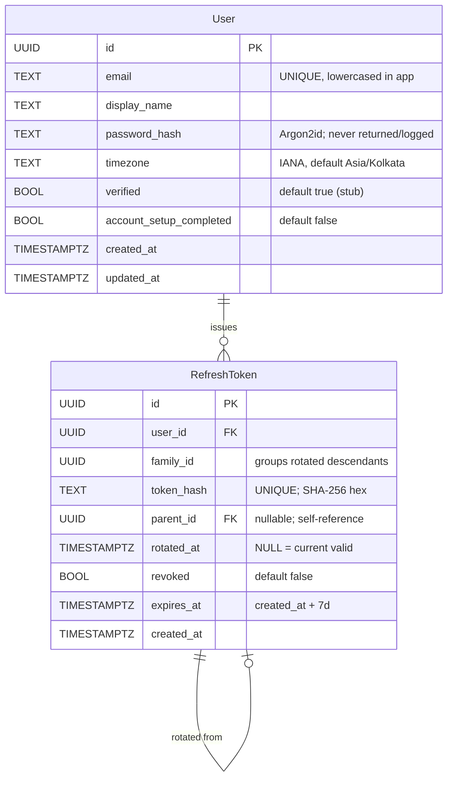

# Domain Entities — auth UoW

**Generated**: 2026-05-12T00:15:00Z
**Driving artifacts**: requirements.md (FRs 001-022, NFR-S01..S10), application-design/application-design.md § Data Stores, Stage-8 Q3=A (no `failed_login_attempts` table), Q4=A (lowercase-in-app email).

---

## Entity: User

**Purpose**: The single human identity that signs up, logs in, completes account setup, sees a Dashboard, and logs out.

| Field | Type | Constraints | Notes |
|-------|------|-------------|-------|
| `id` | UUID | PK; server-generated | UUIDv4 |
| `email` | TEXT | UNIQUE NOT NULL | **Normalized to lowercase in application code BEFORE INSERT/SELECT (Q4=A)**. RFC 5321 ≤ 254 chars (validation rule BR-A01). |
| `display_name` | TEXT | NOT NULL; 1 ≤ length ≤ 100 | User-visible label; rendered on Dashboard |
| `password_hash` | TEXT | NOT NULL | Argon2id encoded string starting `$argon2id$...`. **NEVER returned by any API, NEVER logged.** |
| `timezone` | TEXT | NOT NULL DEFAULT `'Asia/Kolkata'` | IANA name; validated against tzdata at write time |
| `verified` | BOOLEAN | NOT NULL DEFAULT `true` | Auto-set true at signup per FR-003 (B4=A stub flow) |
| `account_setup_completed` | BOOLEAN | NOT NULL DEFAULT `false` | Flipped to true on Account Setup form submit (FR-012) |
| `created_at` | TIMESTAMPTZ | NOT NULL DEFAULT `now()` | UTC |
| `updated_at` | TIMESTAMPTZ | NOT NULL DEFAULT `now()` | Auto-bumped on UPDATE via trigger or ORM hook |

**Indexes**:
- `users_email_unique` — UNIQUE(`email`)
- `users_id_pkey` — PK(`id`)

**Relationships**:
- has many `RefreshToken` (CASCADE on user delete — but v1 has no delete endpoint per BR § 1.4)

**Lifecycle**:
- Created via `POST /auth/signup` with `verified=true`, `account_setup_completed=false`.
- `account_setup_completed=true` once Account Setup form is submitted.
- No delete in v1; test-account cleanup via `docker-compose down -v` (FR-022).

**Invariants** (enforced at Stage 12 by BE schema + tests):
- `email` is always lowercase (BR-A02).
- `password_hash` is never empty and never plaintext (BR-A03).
- `display_name` is never empty (BR-A04).

---

## Entity: RefreshToken

**Purpose**: Track issued refresh tokens for rotation, replay detection, and family revocation (NFR-S10).

| Field | Type | Constraints | Notes |
|-------|------|-------------|-------|
| `id` | UUID | PK; server-generated | UUIDv4 |
| `user_id` | UUID | NOT NULL; FK → `users.id` ON DELETE CASCADE | One user has many tokens |
| `family_id` | UUID | NOT NULL | All tokens born of the same login share a family_id; rotation preserves the family; replay revokes the whole family |
| `token_hash` | TEXT | UNIQUE NOT NULL | **SHA-256 hex of the token string. The raw token NEVER hits the DB.** Lookups use the same hash |
| `parent_id` | UUID | NULLABLE; FK → `refresh_tokens.id` | Pointer to the token this one replaced (chain) |
| `rotated_at` | TIMESTAMPTZ | NULLABLE | NULL = currently valid; non-NULL = already rotated (replay attempt → revoke family) |
| `revoked` | BOOLEAN | NOT NULL DEFAULT `false` | Either via family revoke (replay or logout) or by individual revocation |
| `expires_at` | TIMESTAMPTZ | NOT NULL | `created_at + 7 days` per FR-007 |
| `created_at` | TIMESTAMPTZ | NOT NULL DEFAULT `now()` | UTC |

**Indexes**:
- `refresh_tokens_pkey` — PK(`id`)
- `refresh_tokens_token_hash_unique` — UNIQUE(`token_hash`)
- `refresh_tokens_user_family_idx` — INDEX(`user_id`, `family_id`)

**Relationships**:
- belongs to one `User` (FK cascade)
- belongs to one `parent` `RefreshToken` (self-reference, nullable — the original token of a family has `parent_id = NULL`)

**Lifecycle**:
1. Issued on `POST /auth/login` (new family) or on `POST /auth/refresh` (same family, new generation).
2. On `POST /auth/refresh`, the presented token is looked up by hash:
   - If found AND `rotated_at IS NULL` AND `revoked = false` AND `expires_at > now()` → **rotate**: set `rotated_at = now()` on this row, INSERT new row with same `family_id` and `parent_id = this.id`.
   - If found AND `rotated_at IS NOT NULL` (replay!) → revoke the entire `family_id` (set `revoked = true` for every row in family); return 401.
   - Otherwise → return 401.
3. On `POST /auth/logout`, the entire current family is revoked.
4. Expired rows can be deleted by a maintenance task (out of scope for v1; rows can simply accumulate at ≤ 50 users).

**Invariants**:
- The token string is never in the DB (BR-A05).
- A token cannot be both `rotated_at IS NOT NULL` AND `revoked = false` simultaneously after replay-detection runs (BR-A06).

---

## Out-of-scope entities (deferred)

| Entity | Why deferred |
|--------|---------------|
| `FailedLoginAttempt` | Q3=A — in-memory map sufficient for v1. No DB table. |
| `PasswordResetToken` | BR § 1.4 — password reset out of scope. |
| `OauthIdentity` | BR § 1.4 — no OAuth. |
| `MfaSecret` | BR § 1.4 — no MFA. |
| `AuditLog` | Stage 18 Observability is "light" (B8=A — JSON stdout logs only); no DB-backed audit log in v1. |

---

## ER Diagram

### Text alternative
- `User` has many `RefreshToken` (1:N).
- A `RefreshToken` may have a single `parent` `RefreshToken` (it self-references via `parent_id`).
- The first token of any family (born from `POST /auth/login`) has `parent_id = NULL`.
- Subsequent rotated tokens (born from `POST /auth/refresh`) have `parent_id = previous_token.id`, share the same `family_id`, and the previous token's `rotated_at` becomes non-NULL.

---

## Notes for downstream stages

| Concern | Resolved at | How |
|---------|-------------|-----|
| Physical column names per ORM (Prisma camelCase vs snake_case mapping) | Stage 11 (Stack Selection) | ORM choice dictates style; logical names above |
| Migrations versioning + rollback documentation | Stage 12 Codegen + Stage 16 runbook | Per Codiste convention |
| Index naming convention | Stage 11 | ORM-dependent |
| `failed_login_attempts` ever moves to DB | post-v1; out of scope | If/when BE goes multi-process |
