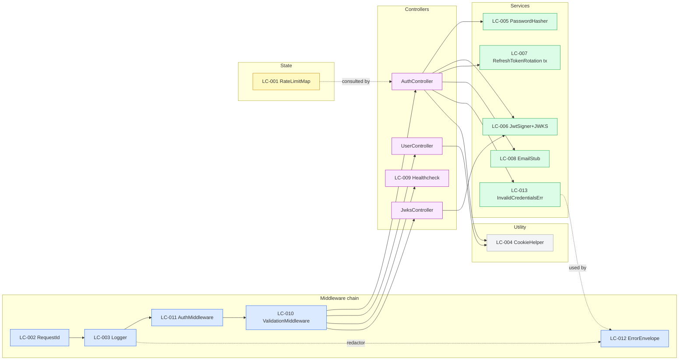

# Logical Components — auth UoW

**Generated**: 2026-05-12T00:20:00Z
**Naming**: `LC-{NN}`. Tech-specific names (library/framework) are **deferred to Stage 11** unless they were already fixed at Stages 4/6/8/9 (e.g., `argon2`, RS256). Each component states (a) purpose, (b) type, (c) the tech-decision-deferred-to-Stage-11 marker, (d) the NFR(s) it owns.

---

## LC-001 — Rate-limit map
**Purpose**: Track failed-login attempts per email to enforce BR-A06 / NFR-SEC-004.
**Type**: in-process state (`Map<email, timestamp[]>`).
**Tech (Stage 11)**: language-native map; no library.
**NFRs owned**: NFR-SEC-004.
**Lifecycle**: per-process; reset on BE restart (acceptable by Q3 of Stage 8); eviction on read.

## LC-002 — Request-ID middleware
**Purpose**: Generate or pass-through a request-id and propagate it to logs + response header.
**Type**: middleware.
**Tech (Stage 11)**: standard middleware contract of the chosen BE framework.
**NFRs owned**: NFR-OBS-004.

## LC-003 — JSON Logger with redactor
**Purpose**: Emit structured JSON logs to stdout with the required field set + redaction of sensitive values.
**Type**: utility (singleton).
**Tech (Stage 11)**: `pino` is Codiste preset for TS/Node. Decision pending Stage 11.
**NFRs owned**: NFR-OBS-001, NFR-OBS-002, NFR-SEC-007.
**Notes**: redactor scans field names — `password`, `passwordHash`, `accessToken`, `refreshToken`, `authorization`, `cookie`, plus `/secret|key|token/i`.

## LC-004 — Cookie helper
**Purpose**: Set/clear auth cookies with the correct flags (BR-A10).
**Type**: utility function.
**Tech (Stage 11)**: language-native; no library.
**NFRs owned**: NFR-SEC-003.
**Two methods**: `setAuthCookies(res, access, refresh)`, `clearAuthCookies(res)`. Other call sites are CI-blocked.

## LC-005 — PasswordHasher service
**Purpose**: Argon2id hash + verify with frozen params.
**Type**: service.
**Tech (Stage 11)**: `argon2` (Codiste preset).
**NFRs owned**: NFR-SEC-001, NFR-TEST-002a (PBT round-trip).
**Two methods**: `hash(plain) → string`, `verify(plain, hash) → boolean`. Params constant: `memoryCost=19_456` (19 MiB), `timeCost=2`, `parallelism=1`, `type=argon2id`.

## LC-006 — JWT signer + JWKS cache
**Purpose**: Sign access (15m) + refresh (7d) tokens RS256; serve JWKS for verification.
**Type**: service.
**Tech (Stage 11)**: `jose` or `jsonwebtoken` (Codiste preset — `jose` slightly preferred for first-party JWKS).
**NFRs owned**: NFR-SEC-002, NFR-TEST-002b (PBT JWT round-trip).
**JWKS endpoint**: `GET /.well-known/jwks.json` with `Cache-Control: public, max-age=86400` (Stage 10 Q3=B — 24h cache).

## LC-007 — RefreshTokenRotation transaction service
**Purpose**: Atomic rotate-or-revoke-family for refresh-token use (P-SEC-007).
**Type**: service wrapping a DB transaction.
**Tech (Stage 11)**: ORM transaction API (Prisma `$transaction`, SQLAlchemy `with session.begin()`, GORM `Transaction`).
**NFRs owned**: NFR-SEC-010, NFR-TEST-002d (PBT refresh rotation).
**SQL**: SELECT FOR UPDATE on the row by `token_hash`; UPDATE rotated_at OR UPDATE revoked WHERE family_id=?; INSERT successor row.

## LC-008 — EmailStub
**Purpose**: Emit a single JSON line to stdout simulating verification email (Stage 8 Q2=A: 7-field shape).
**Type**: service.
**Tech (Stage 11)**: language-native console / logger; no SMTP library.
**NFRs owned**: BR-A12 (logging) + correctness of the stub shape.
**Output (one stdout line per signup)**: `{"event":"email_verification_stub","to":"<email>","subject":"<subj>","body":"<body>","verification_token":"<uuid>","request_id":"<request_id>","timestamp":"<ISO 8601 UTC>"}`.

## LC-009 — Healthcheck controller
**Purpose**: `GET /health` returns 200 `{status: "ok", version, commit}`.
**Type**: controller.
**Tech (Stage 11)**: BE framework route.
**NFRs owned**: NFR-REL-001.

## LC-010 — Validation middleware
**Purpose**: Server-side schema validation for body / query / params.
**Type**: middleware.
**Tech (Stage 11)**: `zod` (Codiste preset for TS) — Stage 11 confirms.
**NFRs owned**: NFR-SEC-006, NFR-MAINT-002 (validation logic isolated → keeps controller complexity low).

## LC-011 — Auth middleware
**Purpose**: Verify access-token cookie; populate `ctx.user_id`; reject expired or invalid.
**Type**: middleware.
**Tech (Stage 11)**: BE framework middleware contract; uses LC-006.
**NFRs owned**: NFR-SEC-003 (cookie-based session enforcement).

## LC-012 — Error-envelope middleware
**Purpose**: Convert any unhandled error to an RFC 7807 `application/problem+json` response with `request_id`.
**Type**: middleware (outermost catch).
**Tech (Stage 11)**: BE framework error-handler contract.
**NFRs owned**: NFR-OBS-004 (request-id propagation in errors), NFR-SEC-009 (uses LC-013 for credentials errors).

## LC-013 — Account-enumeration-safe error builder
**Purpose**: Single function returning the SAME RFC 7807 envelope for signup-duplicate and login-fail paths.
**Type**: utility function.
**Tech (Stage 11)**: language-native.
**NFRs owned**: NFR-SEC-009.
**Spec**: `invalidCredentialsError(request_id) → { type, title, status, detail, request_id }`.

---

## Component graph (Mermaid)

### Text alternative
- Middleware chain (FIRST → LAST): `RequestId → Logger → AuthMiddleware → ValidationMiddleware → Controllers`; `ErrorEnvelope` is the outermost catch.
- Controllers call services as needed: AuthController uses PasswordHasher, JwtSigner, RefreshTokenRotation tx, EmailStub, InvalidCredentialsErr, CookieHelper.
- RateLimitMap is consulted by AuthController before delegating to AuthService for `/auth/login`.
- The Logger embeds the redactor; the Error-envelope middleware uses InvalidCredentialsErr to produce the enumeration-safe envelope.
