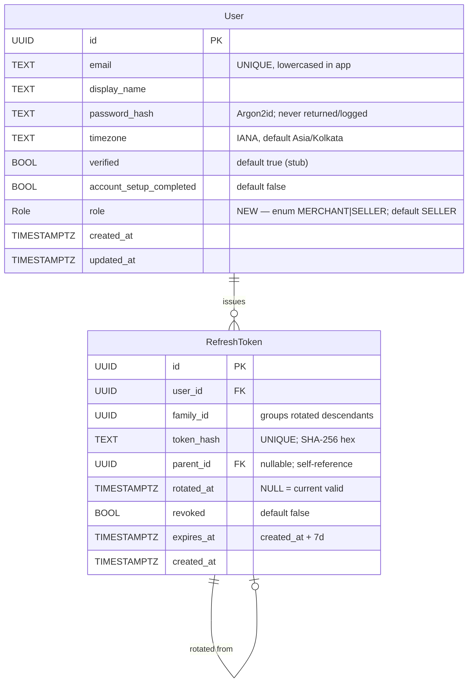

# Domain Entities — `roles-profile` UoW (amendment over auth)

**Tier**: Feature     **Generated**: 2026-05-13T09:35:00+05:30
**Format**: amendment — extends `aidlc-docs/construction/auth/functional-design/domain-entities.md`

---

## Entity: User — field delta

One new field is appended to the auth-UoW `User` entity. All other fields are inherited unchanged.

| Field | Type | Constraints | Notes |
|-------|------|-------------|-------|
| `role` | ENUM `Role` (`MERCHANT` \| `SELLER`) | NOT NULL DEFAULT `'SELLER'` | Captured at signup (BR-A13). Default exists for backwards-compat backfill (BR-A14); the API contract still treats role as a required input on signup. Returned by `GET /users/me`, `POST /auth/signup` response, `POST /auth/login` response. |

### New Postgres type
```sql
CREATE TYPE "Role" AS ENUM ('MERCHANT', 'SELLER');
```

### Invariants added (enforced at Stage 12 by BE schema + tests)
- `users.role` is always one of `MERCHANT` or `SELLER` (Postgres enum guarantees this at the storage layer).
- `users.role` is never NULL (NOT NULL on the column).
- `users.role` chosen at signup is forwarded byte-identical from request to row (NFR-T05 integration test).

### Indexes / Relationships
- No new index — cardinality is 2; queries do not filter by role in v1.
- No new relationship — `Role` is an enum value type, not a table.

---

## ER Diagram — delta



### Text alternative
- `User` gains a `role` enum field. All previously documented relationships and cascade rules from the auth UoW are unchanged.
- `RefreshToken` is unchanged — refresh-token semantics do not depend on the user's role.

---

## Out-of-scope entities (still deferred)

The auth-UoW deferral table (`FailedLoginAttempt`, `PasswordResetToken`, `OauthIdentity`, `MfaSecret`, `AuditLog`) remains unchanged. No new entities are added by this UoW.

---

## Notes for downstream stages

| Concern | Resolved at | How |
|---------|-------------|-----|
| Prisma codegen update for the new field | Stage 12 | `prisma generate` after schema edit |
| Migration ordering (0001 auth → 0002 add_role) | Stage 12 | new file `prisma/migrations/0002_add_role/migration.sql` |
| Backwards-compat backfill safety | Stage 14 | AC US-009 final criterion verifies existing rows read `role='SELLER'` |
| Shared TS union (FE+BE alignment per NFR-MAINT-003) | Stage 12 | `shared/role.ts` exports `type Role = 'MERCHANT' \| 'SELLER'` |

---

## Modification Log
| Timestamp (ISO) | Editor | Change |
|-----------------|--------|--------|
| 2026-05-13T09:35:00+05:30 | AI-DLC | Initial creation. One new field (`role`) on `User`; one new Postgres enum type `Role`; no new entities; ER diagram updated with annotation. |
