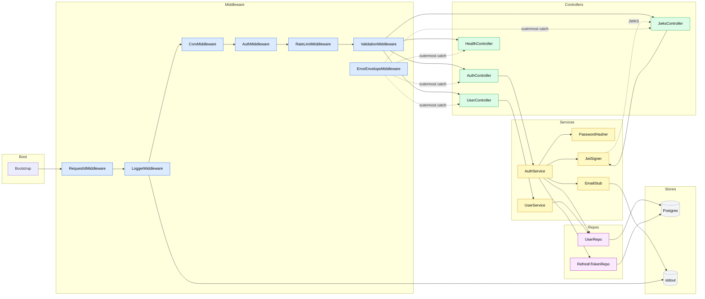
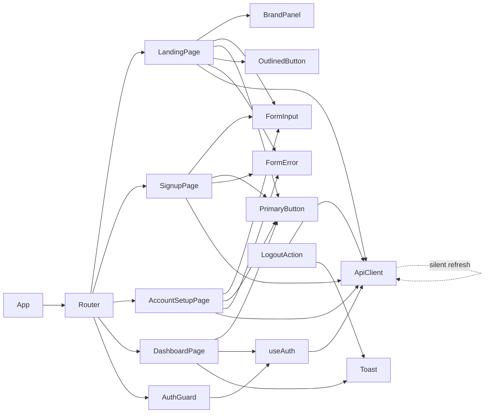

# Component Dependency

**Generated**: 2026-05-12T00:11:00Z

## Backend dependency graph (Mermaid)



## Frontend dependency graph



## Cross-stack edges (dashed)

```mermaid
flowchart LR
    subgraph FE
      ApiClient_FE[ApiClient]
    end
    subgraph BE
      AC[AuthController]
      UC[UserController]
      HC[HealthController]
      JC[JwksController]
    end

    ApiClient_FE -. POST /auth/signup .-> AC
    ApiClient_FE -. POST /auth/login .-> AC
    ApiClient_FE -. POST /auth/refresh .-> AC
    ApiClient_FE -. POST /auth/logout .-> AC
    ApiClient_FE -. GET /users/me .-> UC
    ApiClient_FE -. PATCH /users/me/profile .-> UC
    ApiClient_FE -. GET /health .-> HC
    ApiClient_FE -. GET /.well-known/jwks.json .-> JC
```

All cross-stack edges are documented in **OpenAPI 3.1** at `apps/backend/openapi.yaml` (path TBD per Stage 11).

---

## Dependency matrix (component → component)

The matrix below is "what depends on what". Row depends on column. ✓ = depends on. — = no direct dependency.

### Backend

| ↓ depends on / column → | UserRepo | RefreshTokenRepo | PasswordHasher | JwtSigner | EmailStub | Logger |
|--------------------------|:--------:|:----------------:|:--------------:|:---------:|:---------:|:------:|
| **AuthController**        | — | — | — | — | — | ✓ |
| **UserController**        | — | — | — | — | — | ✓ |
| **AuthService**           | ✓ | ✓ | ✓ | ✓ | ✓ | ✓ |
| **UserService**           | ✓ | — | — | — | — | ✓ |
| **UserRepo**              | — | — | — | — | — | ✓ |
| **RefreshTokenRepo**      | — | — | — | — | — | ✓ |
| **Middleware (all)**      | — | — | — | (Auth only ✓) | — | ✓ |

### Frontend

| ↓ depends on / column → | useAuth | ApiClient | Toast | Router |
|--------------------------|:-------:|:---------:|:-----:|:------:|
| **App**                   | — | — | — | ✓ |
| **AuthGuard**             | ✓ | — | — | ✓ |
| **LandingPage**           | — | ✓ | — | — |
| **SignupPage**            | — | ✓ | — | — |
| **AccountSetupPage**      | — | ✓ | — | — |
| **DashboardPage**         | ✓ | — | — | — |
| **LogoutAction**          | — | ✓ | ✓ | ✓ |

---

## Forbidden dependencies

| Forbidden | Why |
|-----------|-----|
| Controllers → Repositories (directly) | Must go through Services for testability + transaction control |
| Repositories → Services | Repos are pure data access; coordinating multi-repo work belongs in services |
| `EmailStub` → real SMTP library | v1 is stub-only (BR § 1.4) — `EmailStub` is the boundary |
| FE component → raw `fetch` (bypassing `ApiClient`) | Centralizes silent-refresh + cookie semantics; bypass breaks NFR-S10 testability |
| Any module → `process.env` directly | Env reading happens once in `bootstrap`; configured config object is injected (testability + fail-fast) |
| Test code → real Postgres in unit tests | Unit tests use repo doubles; integration tests use the docker-compose Postgres |
