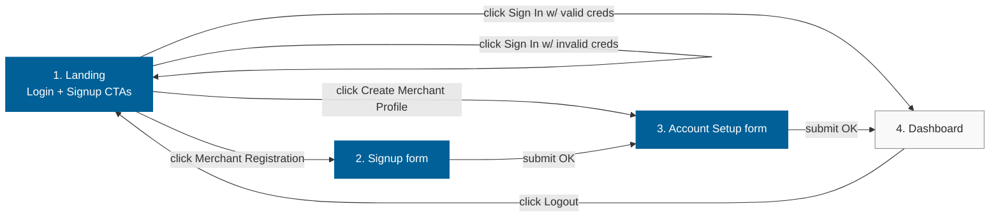

# Screen Flow Map

**Source**: Figma file `He1Wne35awqY445vBFXIhI` — single canvas at page `0:1` (1440 × 1080).
**Captured at**: 2026-05-12T00:05:00Z
**Captured by**: Figma MCP `get_metadata` + `get_design_context`.

---

## Important: design is single-screen

The supplied Figma contains exactly **one screen** — the **login + signup landing**. No additional frames for the actual signup form, account-setup form, or post-login dashboard exist in the file. The flow below combines (a) the structure visible in the design and (b) the BR-implied flow (account setup post-login).

> **Open question** (to team lead): are additional screens coming, or do we generate the post-landing screens using the same token system without dedicated Figma frames?

---

## Screens

| # | Screen | Source | Tier-1 / Tier-2 | Notes |
|---|--------|--------|-----------------|-------|
| 1 | **Landing — Login + Signup CTAs** | Figma frames `1:2`, `1:5`, `1:23`, `1:36` | **Tier-1** | The only Figma-supplied screen. Split layout: left (brand + two CTAs), right (logo + sign-in form). |
| 2 | **Signup form** ("Merchant Registration") | NOT in Figma; click target of left-panel button at `1:20` | Tier-1 (BR-required) | Email + display name + password fields. Routes from Landing → here. |
| 3 | **Account Setup form** ("Create Merchant Profile") | NOT in Figma; click target of left-panel button at `1:17` | Tier-1 (BR-required) | Post-signup profile completion. Routes from Signup → here (or from Landing → here if user has a Merchant Id). |
| 4 | **Dashboard / Home (logged-in)** | NOT in Figma | Tier-2 (placeholder for v1) | Simple "Hello, {display_name}" + Logout. Routes from Login or Account Setup. |
| 5 | **Logout / session ended** | NOT in Figma; same as Landing | Tier-2 | Returning to Landing. Routes back to Screen 1. |

---

## Navigation Graph (Mermaid)

(See `common/content-validation.md` for Mermaid validation rules. Text alternative below.)

## Text Alternative

- **Landing** (1) → click **Sign In** with valid credentials → **Dashboard** (4)
- **Landing** (1) → click **Sign In** with invalid credentials → **Landing** (1) with inline error
- **Landing** (1) → click **Merchant Registration** (left-panel outlined button) → **Signup form** (2)
- **Landing** (1) → click **Create Merchant Profile** (left-panel outlined button) → **Account Setup form** (3)
- **Signup form** (2) → submit valid → **Account Setup form** (3)
- **Account Setup form** (3) → submit valid → **Dashboard** (4)
- **Dashboard** (4) → click **Logout** → **Landing** (1)

---

## Field inventory (Tier-1 screens)

### Screen 1 — Landing → Sign In form (right side)
| Field | Type | Required | Source | Validation (Stage 8 will refine) |
|-------|------|----------|--------|----------------------------------|
| Username | text input | ✓ | figma:1:27 / label `1:29` ("Username") | **Note**: Figma label says "Username" but BR § 2.8 specifies `email` as login identifier. We will use **email** as the identifier; UI label will read "Email" (override Figma copy). |
| Password | password input | ✓ | figma:1:30 / label `1:32` ("Password") | min 12 chars, Argon2id hash on backend (BR § 3.4) |
| (no remember-me, no "forgot password" link) | — | — | — | BR § 1.4 — out of scope |
| Sign In | submit button | — | figma:1:33 — orange `#ef8022` pill | Disabled when fields empty (Codiste house) |

### Screen 2 — Signup form (NOT in Figma; derived from BR + Codiste house)
| Field | Type | Required | Source |
|-------|------|----------|--------|
| Email | email input | ✓ | BR § 2.8 |
| Display name | text input | ✓ | BR § 2.8 |
| Password | password input + confirm | ✓ | BR § 2.8 + § 3.4 (Argon2id) |
| Submit ("Create account") | button | — | mirror primary button from Figma |

### Screen 3 — Account Setup form (NOT in Figma; sparse derivation from BR)
| Field | Type | Required | Source |
|-------|------|----------|--------|
| Display name (pre-filled from signup) | text input | ✓ | BR § 2.8 |
| Timezone | select | ✗ | Codiste house — "Asia/Kolkata" default per `aidlc-profile.md` locale.timezone |
| (NO profile picture upload — BR § 1.4 out of scope) | — | — | — |
| Submit ("Finish setup") | button | — | mirror primary button |

---

## Component reuse map

Components observed in Figma that will be reused across screens 2–5:

| Component | Figma anchor | Reuse across |
|-----------|--------------|--------------|
| **Form input** (62 tall, `#f9f9f9` bg, 6px radius) | `1:27`, `1:30` | All form fields on Signup, Account Setup |
| **Primary button** (orange, pill, 62 tall) | `1:33` | Sign In, Create account, Finish setup, Logout |
| **Outlined button** (white border, pill, 56 tall) | `1:17`, `1:20` | Secondary CTAs (e.g. "Cancel") |
| **Heading typography** (Avenir Heavy 42/52) | `1:25` | All screen titles |
| **Subtitle typography** (Avenir Medium 16/22, color `#908d8d`) | `1:26` | All screen descriptions |
| **Brand panel** (`#016097` left half) | `1:5` | Reuse on Signup / Account Setup with different CTAs / copy; collapsible at `< 768px` |

---

## Open Questions (carry forward to Stage 6 — Application Design)

1. **Are screens 2, 3, 4, 5 going to receive dedicated Figma frames**, or do we proceed with code that uses screens-1 tokens + Codiste house defaults? *(Likely the latter — "small scope, learning experiment".)*
2. **Login identifier**: Figma label is "Username" but BR § 2.8 specifies `email`. Confirm: relabel UI to "Email" in implementation. *(Recommendation: yes, relabel.)*
3. **Two left-panel CTAs** — "Merchant Registration" (start new) vs "Create Merchant Profile" (have Merchant Id). For v1 (no real merchant-id issuance) we likely collapse these into a **single "Sign Up" CTA** that goes to Signup → Account Setup. Confirm with team lead.
4. **Mobile breakpoint design** — none in Figma. Use Codiste house defaults (see `design-tokens.md` § Responsive notes) unless designer provides specifics.
5. **Error / loading / disabled states** — none in Figma. Use Codiste house defaults (red `#dc2626` for errors; spinner inside button on submit; disabled = 50% opacity).
6. **Logo over `#016097` background** — current Figma only places the dark "zone" logo on the white right-half. If we ever need the logo on the blue panel (e.g., mobile collapsed header), we need an inverted variant.
7. **Typo correction policy** — fix `Recieved` → `Received` and `expeirence` → `experience` in implementation, or preserve as-is? *(Recommendation: fix; flag back to designer.)*
