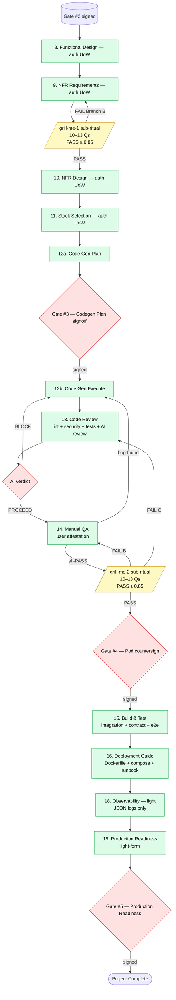

# Execution Plan

**Project**: login-account-setup
**Tier**: Greenfield
**Generated at**: 2026-05-12T00:12:00Z
**Stacks affected**: Frontend (Web) + Backend (framework TBD Stage 11) + Postgres + docker-compose

---

## Scope, Change Impact, Risk

### Scope
- **Stacks affected**: 1 FE (Web) + 1 BE + 1 DB
- **Files affected**: greenfield (0 → many; all new)
- **Stories included**: all 8 (US-001 … US-008)
- **Components included**: 16 FE + 20 BE + 4 Shared (per `application-design/components.md`)

### Change Impact
- **User-facing changes**: ✅ Yes — Landing / Signup / Account Setup / Dashboard / Logout flow
- **API contract changes**: ✅ Yes — net-new contract: 8 endpoints, OpenAPI 3.1
- **Schema changes**: ✅ Yes — net-new: `users`, `refresh_tokens` (optional `failed_login_attempts`)
- **NFR changes**: ✅ Yes — all 31 NFRs are net-new
- **Breaking changes**: ❌ None (no existing system)

### Risk Assessment
- **Risk level**: **LOW**
- **Top three risks**:
  1. **Crypto misuse** (Argon2id params, RS256 keypair handling) — mitigated by NFR-T02 property-based tests + Security extension audit at Stage 13.
  2. **Account-enumeration leak** (NFR-S09) — mitigated by paired byte-identical response tests at Stage 13 + Manual QA scenario at Stage 14.
  3. **Token refresh family-revoke regression** — mitigated by NFR-T02d PBT and Stage-14 replay scenario.

### Multi-Module Coordination
- **Stack hand-offs**: BE produces OpenAPI spec → FE codegens typed client → FE builds against it. Single-cadence deploy via docker-compose.
- **Sequencing constraints**: DB migration runs before BE start; BE starts before FE depends on health-check; all three are managed by `docker-compose up` order/dependencies.
- **Cross-stack contract update plan**: any post-Gate-#3 OpenAPI change requires re-running Stage 12 Codegen plan for the affected UoW (no breaking change should be possible without a new Gate #3).

---

## Stage Decisions

| # | Stage | Execute? | Depth | Notes |
|---|-------|----------|-------|-------|
| 7b | Units Generation | **Skip** (default) — single UoW `auth` chosen | — | Pod may flip to multi-UoW at Gate #2 signing; see § Unit Execution Order |
| 8 | Functional Design | Execute per UoW | **Standard** | Domain entities + business rules + FE component tree already largely scoped in App Design; Stage 8 refines per-UoW |
| 9 | NFR Requirements | Execute per UoW | **Standard** | Stage 4 requirements.md already enumerates 31 NFRs; Stage 9 acceptance-checks per UoW |
| — | `/grill-me-1` sub-ritual (post-9) | **Execute** | 10–13 Qs | Mandatory for Greenfield; user-stated requirement from initial invocation |
| 10 | NFR Design | Execute per UoW | **Standard** | Patterns + logical components — design pack already drafts most |
| 11 | Stack Selection | **Execute per UoW** | — | Concrete FE / BE frameworks resolved here (Codiste preset suggests Next.js + NestJS but pod chooses) |
| 12 | Code Generation | Execute per UoW | **Comprehensive** plan | Gate #3 per UoW |
| 13 | Code Review | Execute per UoW | full (lint + security + tests + AI review) | AI verdict; runs PBT + security audit per Stage 4 opt-ins |
| 14 | Manual QA | Execute per UoW | **full FR coverage** | Pod attestation; bug-loop cap = 3 cycles |
| — | `/grill-me-2` sub-ritual (post-14) | **Execute** | 10–13 Qs | Mandatory for Greenfield; user-stated requirement |
| 15 | Build & Test | Execute (once after all UoWs) | **Full suite** | Integration + contract + e2e (Playwright per Codiste preset, confirmed at Stage 11) |
| 16 | Deployment Guide | **Execute** | Standard | `Dockerfile` per stack + `docker-compose.yml` + `runbook.md` |
| 17 | Infrastructure-as-Code | **Skip** | — | No real cloud target for v1; docker-compose on a dev host is sufficient. Re-open if reused on a client engagement. |
| 18 | Observability Setup | **Execute — light** | Minimal | JSON-structured stdout logs (per `aidlc-profile.md` field schema). Sentry/Datadog deferred per FollowupQ B8=A. |
| 19 | Production Readiness | **Execute (Gate #5)** | **Light-form** | "Light-form" per BR § 1.3 — process is the metric; no real prod deploy. Pod still signs Gate #5. |

---

## Unit Execution Order

The pod can override this section by editing it directly before signing Gate #2. The default proposal is **1 UoW**:

```
1. auth — Backend + Frontend + DB schema for the entire login + account-setup feature
   • Stacks: Frontend (Web) + Backend + Postgres
   • Stories: US-001, US-002, US-003, US-004, US-005, US-006, US-007, US-008 (all 8)
   • Estimated size: M (≈ 2–3 bolts)
   • Rationale: matches Codiste team default ("keep FE+BE together when deployment cadence is the same"). Single docker-compose deploy. No cross-UoW sequencing complexity.
```

### Alternative (pod can pick this at Gate #2 by writing an `## Objection` + proposed override)

```
1. backend-auth — BE-only: endpoints, services, repos, OpenAPI spec, DB schema, BE tests
   • Stacks: Backend + Postgres
   • Stories owned: US-001 (BE side), US-002 (BE side), US-003 (BE side), US-004 (BE side), US-005 (BE side), US-006 (BE side), US-008 (BE-only verification)
   • Estimated size: M

2. frontend-auth — FE-only: pages, components, ApiClient (codegened against UoW-1 OpenAPI), FE tests
   • Stacks: Frontend (Web)
   • Stories owned: US-001 (FE side), US-002 (FE side), US-003 (FE side), US-004 (FE side), US-005 (FE side), US-006 (FE side), US-007 (a11y audit)
   • Estimated size: M
   • Depends on: `backend-auth` (consumes its OpenAPI spec for codegen)

Trade-off: 2 UoWs adds one extra Gate #3 cycle + one extra Gate #4 cycle (two of each instead of one), but enables BE to be merged + dogfooded before FE work starts. Recommended only if the pod wants the BE/FE stagger.
```

> **Decision point at Gate #2 signing**: by signing without an `## Objection`, the pod accepts **1 UoW = `auth`**. To switch to 2 UoWs, write `## Objection — request 2-UoW split` in the signoff file with rationale; I will then run `inception/units-generation.md` formally before construction begins.

---

## Workflow Visualization



### Text alternative

For the single `auth` UoW:

1. **8 Functional Design** → produces `business-rules.md`, `domain-entities.md`, FE component tree.
2. **9 NFR Requirements** → per-UoW NFR refinement (mostly already drafted).
3. **/grill-me-1** → 10-13-question quiz on FR + NFR.
4. **10 NFR Design** → patterns + logical components.
5. **11 Stack Selection** → pod picks specific FE + BE frameworks for this UoW.
6. **12a Code Gen Plan** → codegen plan with file list.
7. **Gate #3 (codegen)** — pod signs.
8. **12b Code Gen Execute** → AI writes the code.
9. **13 Code Review** → lint + security + unit-tests + AI review → emits `PROCEED` or `BLOCK`.
   - **BLOCK** → loop back to 12b.
10. **14 Manual QA** → pod runs scenarios → all-PASS or bug → bug routes back to 12b (cap 3 cycles).
11. **/grill-me-2** → 10-13-question quiz on the built UoW.
12. **Gate #4** — pod countersigns once auto-checks + Manual QA + grill-me-2 are all ✅.
13. **15 Build & Test** → integration / contract / e2e suite.
14. **16 Deployment Guide** → Dockerfile + compose + runbook.
15. **18 Observability — light** → JSON logs config (Sentry/Datadog deferred per BR).
16. **19 Production Readiness** → light-form readiness checklist.
17. **Gate #5** — pod signs production readiness.

**Stage 17 IaC is skipped** (no cloud target for the learning experiment).

---

## Extension Compliance Plan

| Extension | Where it applies | Owner artifact(s) |
|-----------|------------------|--------------------|
| **Security baseline** | Stages 8 (entity-level secrets ban), 9 (NFR-S0x enumerated), 10 (cookie/JWT design), 12 (codegen plan must mark each NFR-S row), 13 (lint + SAST + paired-response test + log-scrape), 19 (final cross-check) | NFR-S01..S10 in `requirements.md` |
| **Property-Based Testing** | Stage 8 (identify properties), Stage 12 (codegen plan lists property-test files), Stage 13 (PBT runs as part of test step) | NFR-T02 (a-d) in `requirements.md` |
| **Accessibility (WCAG 2.2 AA)** | Stage 8 (component a11y notes), Stage 12 (codegen plan marks NFR-A rows), Stage 13 (axe-core scan), Stage 14 (manual a11y pass per US-007), Stage 15 (e2e a11y scenarios), Stage 19 (cross-check) | NFR-A01..A08 in `requirements.md` |
| AI/ML lifecycle | **N/A — opted out** | — |

---

## Estimates (rough order of magnitude — informational only)

| Phase | Estimate |
|-------|----------|
| Inception remaining (Stage 7 close + Gate #2 sign) | < 1 day |
| Construction (Stages 8 → 15 for 1 UoW) | 2–4 working days (small slice; depends on per-pod cadence) |
| Operations (Stages 16, 18, 19 + Gate #5) | 0.5–1 working day |
| **Total** (calendar, async pod) | **≈ 1–2 weeks** with normal Codiste working pace; this is a learning experiment, so the pod sets the cadence |
