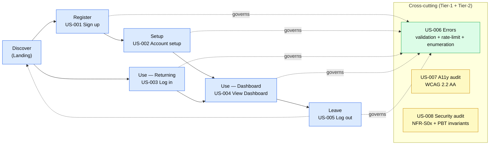

# Story Map

**Persona**: 1 — `CodisteTeammate` (see `personas.md`)
**Total stories**: 8 (6 Tier-1 + 2 Tier-2)
**Map axis**: Persona × Journey phase
**Generated**: 2026-05-12T00:09:00Z

---

## Journey × Tier table

| Journey phase ↓  /  Tier → | **Tier 1 — MVP critical** | **Tier 2 — verification** |
|----------------------------|----------------------------|----------------------------|
| **Discover** (arrive at Landing) | (no story — Landing is rendered by US-001 / US-003) | — |
| **Register** | US-001 Sign up | — |
| **Setup**    | US-002 Complete account setup | — |
| **Use** (returning) | US-003 Log in | — |
| **Use** (in-app) | US-004 View Dashboard | — |
| **Leave**    | US-005 Log out | — |
| **Cross-cutting — Errors** | US-006 Validation / rate-limit / enumeration | — |
| **Cross-cutting — Verification** | — | US-007 Accessibility audit • US-008 Security & PBT audit |

---

## Mermaid journey flow

## Text alternative

- **Discover** → **Register** (US-001 Sign up) → **Setup** (US-002 Account setup) → **Use** (US-004 View Dashboard).
- For returning users: **Discover** → **Use — Returning** (US-003 Log in) → **Use — Dashboard** (US-004).
- After **Use**: → **Leave** (US-005 Log out) → loop back to Discover (dotted arrow).
- **Cross-cutting (Tier-1)**: US-006 Errors *governs* every journey phase (validation, rate-limit, enumeration-safe responses appear wherever forms or auth requests live).
- **Cross-cutting (Tier-2 verification)**: US-007 (a11y audit) and US-008 (security/PBT audit) run during Stage 13 (Code Review) and Stage 14 (Manual QA); they verify the implementation built by Tier-1 stories.

---

## Stage 14 — Manual QA scenario derivation hint

When Manual QA fires (per UoW at Stage 14), the pod will derive scenarios primarily from:

| Source story | Scenarios |
|--------------|-----------|
| US-001 | Signup happy path; duplicate-email; invalid email; short password; verify auto-verification stub |
| US-002 | Account-setup happy path; setup-incomplete redirect; double-completed redirect |
| US-003 | Login happy path; wrong password (NFR-S09 paired check); access-token expiry → silent refresh; refresh-token replay → family revoke |
| US-004 | Dashboard happy path; unauthenticated redirect to Landing |
| US-005 | Logout happy path; back-button after logout |
| US-006 | All error-handling acceptance criteria (5 forms × 3 error types) |
| US-007 | A11y manual checklist (keyboard nav, screen reader, contrast) |
| US-008 | DevTools cookie inspection; log scrape; header inspection |

This list will be regenerated formally at Stage 14 (`manual-qa-checklist.md`).
